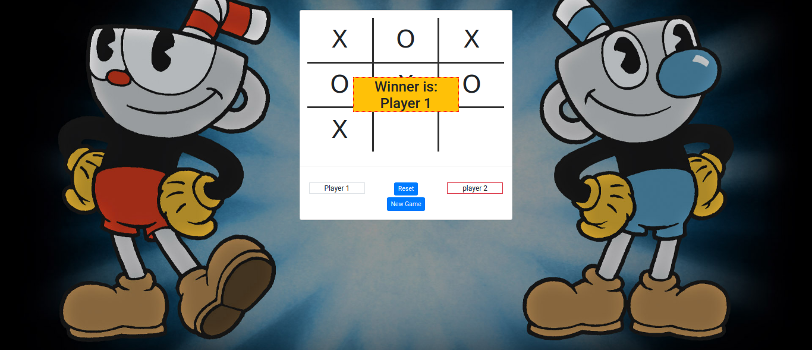

# tic-tac-toe

> This is a web-based game. It's the classic game for two players where each player has to take a turn to fill the board, trying to get the winning combination.

## Screenshots 

- Initial View

- Result View

## Table of Contents

- [Background](#background)
- [Prerequisites](#prerequisites)
- [Built With](#built_with)
- [Install](#install)
- [Maintainers](#maintainers)
- [Contributing](#contributing)
- [License](#license)

## Background
A web-based game that has been built by following the Object-Oriented Programming constraints. To play the game players need to follow the sequences below:

1. The initial task - both players must insert their names.
2. Player must select an unoccupied fild to make a move.
3. The first player who can generate the winning formation will be declared as a winner. The winning combination contains the specification below.
    - Consecutive same symbol in a row  
    OR
    - Consecutive same symbol in a Column  
    OR
    - Consecutive same symbol in any of the dinagonal
4. If there are no empty field and there is no winner, it will declare the game as a draw.

## Prerequisites
- Device must have installed nodejs. You can install it from [here](https://nodejs.org/en/).

## Built_With
- Front-end - html5, CSS3
- Backend - JavaScript

## Install

Open terminal and perform the operation sequentially.

1. Clone the repository `git clone git@github.com:shshamim63/Tic-Tac-Toe.git`
2. Get into the repository `cd Tic-Tac-Toe`
3. To install all the dependencies `npm install`
4. To start the project `npm start` . which will start the live-server in your default browser.

## Maintainers

👤 **Shakhawat Hossain**

- Github: [@shshamim63](https://github.com/shshamim63)
- Twitter: [@Shshamim090](https://twitter.com/Shshamim090)
- Linkedin: [shakhawathossainshamim](https://www.linkedin.com/in/shakhawathossainshamim/)

👤 **Trillan Jose**
- Github: [@trillianjose](https://github.com/trillianjose)

## Contributing

PRs accepted.

Small note: If editing the README, please conform to the [standard-readme](https://github.com/RichardLitt/standard-readme) specification.

## License

MIT © 2019 Shakhawat Hossain
