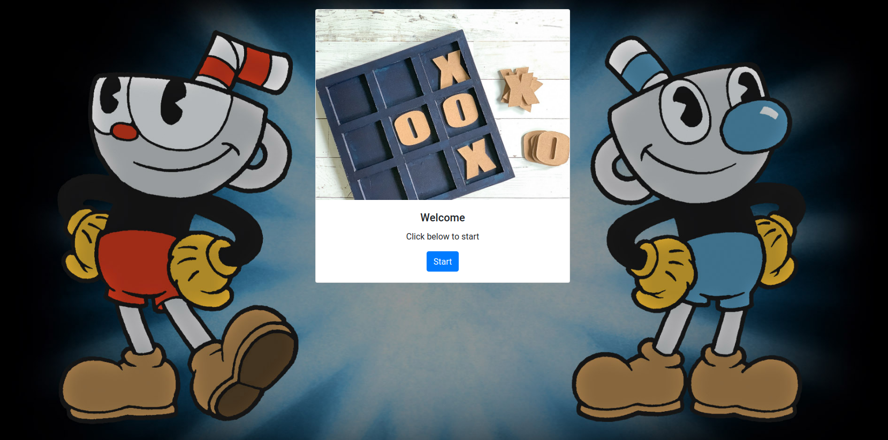

# tic-tac-toe

[](https://github.com/RichardLitt/standard-readme)

> This is a web-based game.

It's the classic game for two player were you take turn to fill the board trying
to get the winning combination that It's in a row a column or diagonal.

## Table of Contents

- [Background](#background)
- [Usage](#usage)
- [Maintainers](#maintainers)
- [Contributing](#contributing)
- [License](#license)

## Background

We used JavaScript and object-oriented methodologies to complete the project.
You also can see the use of basic HTML and SCSS to complete the visual part of
the interface.

## Screenshots 


## Usage

```
run `npm install`
run `npm start`
```

## Maintainers

* [Shakhawat Hossain](https://github.com/shshamim63)
* [Trillan Jose](https://github.com/trillianjose)

## Contributing

PRs accepted.

Small note: If editing the README, please conform to the [standard-readme](https://github.com/RichardLitt/standard-readme) specification.

## License

MIT © 2019 Shakhawat Hossain
